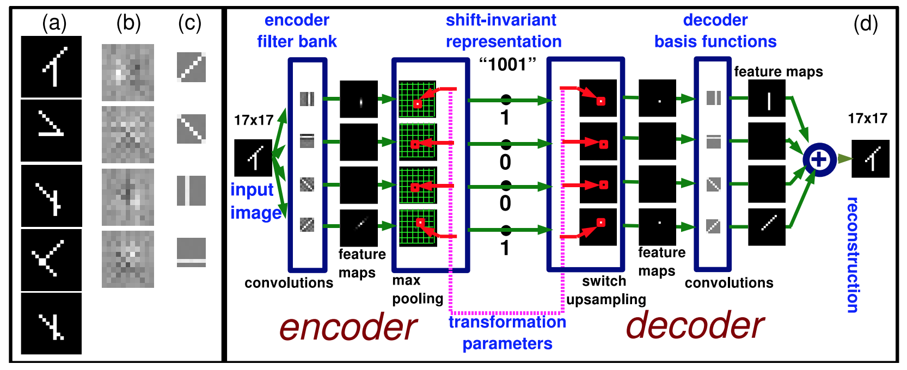

# Generative networks

**Note: this document is a work-in-progress.**

Unsupervised Learning of Invariant Feature Hierarchies with Applications to Object Recognition (Ranzato, et al 2007 [with LeCun]) http://www.cs.nyu.edu/~ylan/files/publi/ranzato-cvpr-07.pdf

Deep Convolutional Inverse Graphics Network (Kulkarni et al 2015) http://arxiv.org/pdf/1503.03167v4.pdf

**Review the references listed**

Learning to Generate Chairs with Convolutional Neural Networks (Dosovitskiy et al 2015) http://arxiv.org/pdf/1411.5928v2.pdf

**Review the references listed**

"We train a generative convolutional neural network which is able to generate images of objects given object type, viewpoint, and color."
"it is impressive that the network is able to process very different inputs – class label, viewpoint and the parameters of additional chromatic and spatial transformations – using exactly the same standard layers of ReLU neurons."

DRAW: A Recurrent Neural Network For Image Generation (Gregor et al 2015 / DeepMind) http://arxiv.org/pdf/1502.04623v2.pdf

Multiple Object Class Detection with a Generative Model (Mikolajczyk et al 2006) http://epubs.surrey.ac.uk/806163/1/eth_biwi_00401.pdf

"Rotation invariance... express the positions of features in polar coordinates, in which the object center is related to local coordinates of features... There are 4 parameters used to represent the geometric information of a feature: d–distance to the object center, φ–angle between the dominant gradient orientation and the vector between object center and feature location, σ–scale (size), and θ–dominant gradient orientation"
"We represent all features extracted from object classes in a single tree structure."

Deconvolutional Networks (Zeiler et al 2010) http://www.matthewzeiler.com/pubs/cvpr2010/cvpr2010.pdf

"based on the convolutional decomposition of images under a sparsity constraint and is totally unsupervised ... [b]y building a hierarchy of such decompositions we can learn rich feature sets that are a robust image representation for both the analysis and synthesis of images"
"... each layer in our Deconvolutional Network is top-down; it seeks to generate the input signal by a sum over convolutions of the feature maps (as opposed to the input) with learned filters."
(Probably similar to stacked autoencoders?)

Deep Deconvolutional Networks for Scene Parsing (Mohan 2014) http://arxiv.org/pdf/1411.4101.pdf

## Additional
Learning the parts of objects by non-negative matrix factorization http://www.researchgate.net/profile/Daniel_Lee27/publication/12752937_Learning_the_parts_of_objects_by_non-negative_matrix_factorization/links/02bfe51279d801b985000000.pdf
